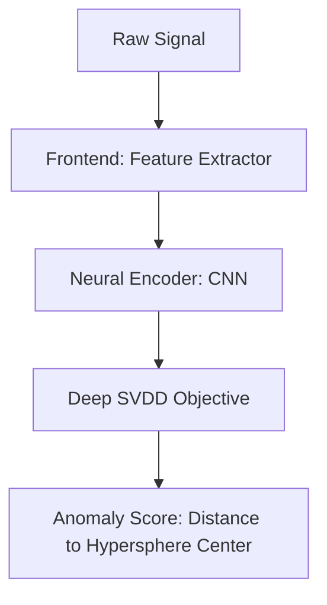

0. End-to-end workflow


1. Repo structure
```text
anomalous-signal-detection/
│
├── configs/
│   ├── default.yaml
│   └── experiments/
│
├── data/
│   └── dataset.py
│
├── frontend/
│   ├── base_frontend.py
│   ├── logmel.py
│   └── physical_filters/      # future physics modules
│
├── models/
│   └──cnn_encoder.py
│
├── losses/
│   └── svdd.py
│
├── evaluation/
│   └── metrics.py
│
├── scripts/
│   ├── train.py
│   └── test.py
│
└── README.md
```
